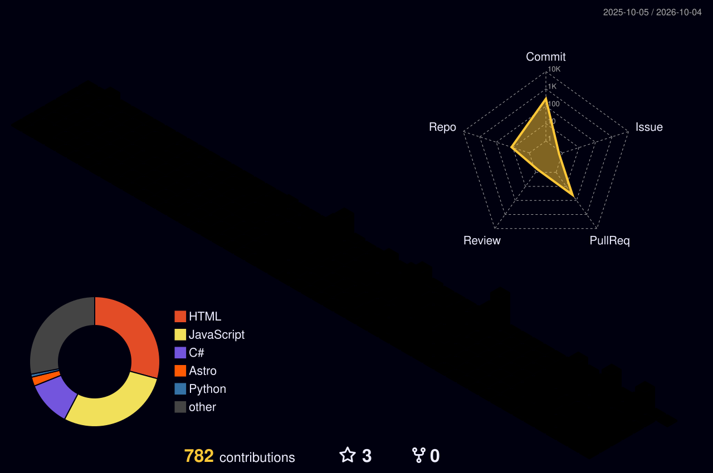

<!-- GIBOR — GitHub Profile README 2026 -->
<!-- Author: Tran Gia Bao (@gibor06) -->
<!-- Theme: Midnight Cyber (Deep Navy #0A0F1D + Neon Cyan #00F2FE + Electric Purple #7928CA) -->

<!-- ============================================================ -->
<!--  01 · HERO                                                    -->
<!-- ============================================================ -->

  

  

<!-- ============================================================ -->
<!--  02 · IDENTITY BADGES                                         -->
<!-- ============================================================ -->

  
  
  
  

<!-- At-a-glance highlights (clickable → jump to section) -->

  
  
  
  

  
  &nbsp;
  

<!-- ============================================================ -->
<!--  03 · NAVIGATION                                              -->
<!-- ============================================================ -->

  <a href="#about"><b>About</b></a> &nbsp;·&nbsp;
  <a href="#tech"><b>Tech</b></a> &nbsp;·&nbsp;
  <a href="#research"><b>Research</b></a> &nbsp;·&nbsp;
  <a href="#achievements"><b>Honors</b></a> &nbsp;·&nbsp;
  <a href="#credentials"><b>Certificates</b></a> &nbsp;·&nbsp;
  <a href="#projects"><b>Projects</b></a> &nbsp;·&nbsp;
  <a href="#stats"><b>Stats</b></a> &nbsp;·&nbsp;
  <a href="#contact"><b>Contact</b></a>

 

  

<!-- ============================================================ -->
<!--  04 · ABOUT                                                   -->
<!-- ============================================================ -->

<table width="100%">
<tr>
<td width="58%" valign="top">

<h2>TRAN GIA BAO (GIBOR)</h2>

> *Data Mining Algorithm Researcher &amp; Full-Stack Software Engineer*

Second-year **Information Technology** student at **Ho Chi Minh City University of Industry and Trade (HUIT)**, focusing on algorithm time complexity, dynamic transaction databases, and scalable AI-driven software architecture.

<b>Key Domains &amp; Strengths:</b>
- **High-Utility Itemset Mining:** Algorithm research (EMHUN, Cross-Itemset Pruning).
- **Computer Vision &amp; NLP:** YOLO, SAM-ViT, PhoBERT Vietnamese comment moderation.
- **Full-Stack Engineering:** ASP.NET MVC, C#, React, Node.js, SQL Server &amp; WinForms.
- **Academic Honors:** 9 faculty &amp; university awards in scientific research &amp; data science.

 

&nbsp;

&nbsp;

</td>
<td width="42%" valign="center" align="center">

 
<b>Trần Gia Bảo (@gibor06)</b> 
<i>Software Engineer · AI Researcher · HUIT</i>

</td>
</tr>
</table>

 

<a href="#top">↑ Back to top</a>

<!-- ============================================================ -->
<!--  05 · CURRENT FOCUS                                           -->
<!-- ============================================================ -->

  

<table align="center" width="100%">
<tr>
<td width="25%" align="center" valign="top">
 

  
<h4>High-Utility Mining</h4>

Researching dynamic transaction databases with EMHUN algorithms

</td>
<td width="25%" align="center" valign="top">
 

  
<h4>Intelligent Systems</h4>

Full-stack applications & scalable software architecture

</td>
<td width="25%" align="center" valign="top">
 

  
<h4>Vision &amp; NLP</h4>

Agricultural AI with YOLO, SAM-ViT & PhoBERT moderation

</td>
<td width="25%" align="center" valign="top">
 

  
<h4>Optimization</h4>

Cross-itemset pruning & computational speedup

</td>
</tr>
</table>

 

<a href="#top">↑ Back to top</a>

<!-- ============================================================ -->
<!--  06 · CYBER COMMAND CENTER                                    -->
<!-- ============================================================ -->

  

  

 

<a href="#top">↑ Back to top</a>

<!-- ============================================================ -->
<!--  07 · TECH STACK                                              -->
<!-- ============================================================ -->

  

<table>
<tr>
<td align="right" width="170"><b>Languages</b></td>
<td></td>
</tr>
<tr>
<td align="right"><b>AI · Machine Learning</b></td>
<td></td>
</tr>
<tr>
<td align="right"><b>Web Development</b></td>
<td></td>
</tr>
<tr>
<td align="right"><b>Mobile Development</b></td>
<td></td>
</tr>
<tr>
<td align="right"><b>Databases</b></td>
<td>

</td>
</tr>
<tr>
<td align="right"><b>Development Tools</b></td>
<td></td>
</tr>
</table>

 

<a href="#top">↑ Back to top</a>

    

<!-- ============================================================ -->
<!--  08 · RESEARCH LAB                                            -->
<!-- ============================================================ -->

  

  <em>Researching algorithms at the intersection of data mining, optimization, and intelligent systems.</em>

<!-- Research 01 -->

<strong>High-Utility Itemset Mining — Primary Research Area</strong>

 

| Field | Details |
| :--- | :--- |
| **Algorithms** | EMHUN, Cross High-Utility Itemset Mining |
| **Domain** | Dynamic transaction databases with negative & positive utility |
| **Focus** | Time optimization, cross-itemset efficiency |
| **Recognition** | 2nd Prize · Consolation Prize · Final Round — Faculty & University Level |

Researching efficient mining algorithms over dynamic transaction databases where items may carry both negative and positive utility values — targeting both accuracy and computational speed.

 

<!-- Research 02 -->

<strong>NLP — PhoBERT Social Content Moderation</strong>

 

| Field | Details |
| :--- | :--- |
| **Model** | PhoBERT (Vietnamese BERT-based language model) |
| **Application** | Detecting and preventing inappropriate online comments |
| **Platform** | Multi Aura Social Network |
| **Recognition** | 3rd Prize — Faculty-Level Scientific Research 2024–2025 |

Applied PhoBERT for Vietnamese natural language processing to build an automated comment moderation system integrated into a full social network platform.

 

<!-- Research 03 -->

<strong>Computer Vision — Rice Pest Detection & Segmentation</strong>

 

| Field | Details |
| :--- | :--- |
| **Pipeline** | YOLO + SAM-ViT (Segment Anything Model — Vision Transformer) |
| **Task** | Pest classification and instance segmentation |
| **Domain** | Agricultural AI / Precision Farming |
| **Recognition** | HUIT Data Science Competition 2025 — Finalist |

Developed a hybrid vision pipeline combining YOLO detection with SAM-ViT segmentation for precise rice pest identification, applicable to precision agriculture systems.

 

<!-- Research 04 -->

<strong>Computer Vision — Skin Cancer Classification</strong>

 

| Field | Details |
| :--- | :--- |
| **Model** | Vision Transformer (ViT) |
| **Task** | Skin cancer classification from dermoscopic images |
| **Domain** | Computer-Aided Medical Diagnosis |
| **Recognition** | HUIT Data Science Competition 2025 — Finalist |

Applied Vision Transformer architecture for multi-class skin cancer classification from dermoscopic images — contributing to AI-assisted early diagnosis systems.

 

<a href="#top">↑ Back to top</a>

<!-- ============================================================ -->
<!--  09 · ACADEMIC ACHIEVEMENTS & WALL OF FAME                    -->
<!-- ============================================================ -->

  

  <em>Honored across Faculty &amp; University Competitions at Ho Chi Minh City University of Industry and Trade (HUIT)</em>

<!-- 2026 Achievements -->

<h3>Academic Year 2025 – 2026 (Recent Honors)</h3>

<table width="100%">
<tr>
<td width="50%" align="center" valign="top">
  
<b>Scientific Research Competition 2025–2026</b> 
<i>Optimizing time complexity in Cross High-Utility Itemset Mining over dynamic databases with negative/positive utility.</i>  

</td>
<td width="50%" align="center" valign="top">
  
<b>Final Round Participant 2025–2026</b> 
<i>Recognized for advancing to the final round with research on high-utility itemset mining over dynamic transaction databases.</i>  

</td>
</tr>
</table>

 

<!-- 2025 Achievements -->

<h3>Academic Year 2024 – 2025 (Scientific Research &amp; Data Science)</h3>

<table width="100%">
<tr>
<td width="50%" align="center" valign="top">
  
<b>Faculty-Level Scientific Research 2024–2025</b> 
<i>EMHUN High-Utility Itemset Mining Algorithm &amp; Its Application in an E-commerce Website for Electronic Products.</i>  

</td>
<td width="50%" align="center" valign="top">
  
<b>Faculty-Level Scientific Research 2024–2025</b> 
<i>Multi Aura Social Network with PhoBERT-based NLP for Detecting &amp; Preventing Inappropriate Online Comments.</i>  

</td>
</tr>
<tr>
<td width="50%" align="center" valign="top">
  
<b>University-Level Research Award (HUIT)</b> 
<i>Consolation Prize at University-wide Scientific Research Competition 2024–2025.</i>  

</td>
<td width="50%" align="center" valign="top">
  
<b>University Award Ceremony 2025</b> 
<i>Honored on stage by the Faculty &amp; University Board of Management.</i>  

</td>
</tr>
<tr>
<td width="50%" align="center" valign="top">
  
<b>HUIT Data Science Competition 2025</b> 
<i>Rice Pest Classification &amp; Instance Segmentation — YOLO + SAM-ViT Hybrid Pipeline.</i>  

</td>
<td width="50%" align="center" valign="top">
  
<b>HUIT Data Science Competition 2025</b> 
<i>Skin Cancer Classification from Dermoscopic Images using Vision Transformers (ViT).</i>  

</td>
</tr>
<tr>
<td width="50%" align="center" valign="top">
  
<b>Database Design Challenge 2025</b> 
<i>Recognized for database modeling, system design, and data architecture.</i>  

</td>
<td width="50%" align="center" valign="top">
  
<b>Excellent Student Award 2024–2025</b> 
<i>Awarded by the Vice Rector of HUIT in recognition of outstanding academic performance.</i>  

</td>
</tr>
</table>

 

<a href="#top">↑ Back to top</a>

<!-- ============================================================ -->
<!--  10 · PROFESSIONAL CERTIFICATIONS                             -->
<!-- ============================================================ -->

  

<table width="100%">
<tr>
<td width="33%" align="center">
<b>Google Business Intelligence</b>  
 

</td>
<td width="33%" align="center">
<b>Google UX Design</b>  
 

</td>
<td width="33%" align="center">
<b>Google Cybersecurity</b>  
 

</td>
</tr>
<tr>
<td width="33%" align="center">
<b>Google Project Management</b>  
 

</td>
<td width="33%" align="center">
<b>Google Data Analytics</b>  
 

</td>
<td width="33%" align="center">
<b>Google AI Essentials</b>  
 

</td>
</tr>
</table>

 

<strong>View Google AI Essentials Module Badges &amp; Faculty Gemini Credential</strong>

 

<table width="100%">
<tr>
<td width="33%" align="center">
<b>Fundamentals of AI</b>  
 
<i>Google AI Essentials</i>
</td>
<td width="33%" align="center">
<b>App Building with AI</b>  
 
<i>Google AI Essentials</i>
</td>
<td width="33%" align="center">
<b>Data Analysis with AI</b>  
 
<i>Google AI Essentials</i>
</td>
</tr>
<tr>
<td width="33%" align="center">
<b>Brainstorming &amp; Planning</b>  
 
<i>Google AI Essentials</i>
</td>
<td width="33%" align="center">
<b>Research &amp; Insights</b>  
 
<i>Google AI Essentials</i>
</td>
<td width="33%" align="center">
<b>Writing &amp; Communicating</b>  
 
<i>Google AI Essentials</i>
</td>
</tr>
<tr>
<td colspan="3" align="center">
 
<b>Faculty Gemini AI Certificate</b>  
 
<i>Certified in Gemini AI Integration &amp; Applications</i>
</td>
</tr>
</table>

 

<a href="#top">↑ Back to top</a>

    

<!-- ============================================================ -->
<!--  11 · SELECTED WORK                                           -->
<!-- ============================================================ -->

  

<table width="100%">
<tr>
<td width="50%" valign="top">
<h3>GIBOR Portfolio</h3>

  
Personal portfolio showcasing projects, technical skills, and development experience through a modern responsive interface.  
 

</td>
<td width="50%" valign="top">
<h3>GIBOR Coffee Shop Website</h3>

  
Front-end brand and management website for a coffee shop, built as a team project with a focus on modern UI and user experience.  
 

</td>
</tr>
<tr>
<td width="50%" valign="top">
<h3>Coffee Chain Management System</h3>

  
Full-stack multi-branch coffee chain management system — product management, order processing, inventory tracking, and sales reporting via an integrated dashboard.  
 

</td>
<td width="50%" valign="top">
<h3>Coffee Shop Management Software</h3>

  
Desktop application for daily coffee shop operations — order processing, product administration, customer management, and sales monitoring.  
 

</td>
</tr>
</table>

 

<a href="#top">↑ Back to top</a>

    

<!-- ============================================================ -->
<!--  12 · GITHUB INTELLIGENCE                                     -->
<!-- ============================================================ -->

  

<!-- GitHub Trophy Showcase -->

  

 

<!-- Hàng 1: Stats & Top Languages -->

  
  &nbsp;
  

<!-- Hàng 2: Streak Stats -->

  

 

<a href="#top">↑ Back to top</a>

<!-- ============================================================ -->
<!--  13 · ACTIVITY GRAPH                                          -->
<!-- ============================================================ -->

  

  

 

<!-- ============================================================ -->
<!--  14 · GITHUB PROFILE SUMMARY                                  -->
<!-- ============================================================ -->

  

  

  
  &nbsp;
  
  &nbsp;
  

 

<a href="#top">↑ Back to top</a>

<!-- ============================================================ -->
<!--  15 · 3D CONTRIBUTION UNIVERSE                                -->
<!-- ============================================================ -->
<!-- Requires: Actions → GitHub-Profile-3D-Contrib → Run workflow (once after push) -->

  

  <picture>
    <source media="(prefers-color-scheme: dark)" srcset="profile-3d-contrib/profile-night-rainbow.svg"/>
    <source media="(prefers-color-scheme: light)" srcset="profile-3d-contrib/profile-gitblock.svg"/>
    
  </picture>

 

<a href="#top">↑ Back to top</a>

<!-- ============================================================ -->
<!--  16 · CONTRIBUTION SNAKE                                      -->
<!-- ============================================================ -->
<!-- Requires: Actions → Generate Snake → Run workflow (once after push) -->

  

  <picture>
    <source media="(prefers-color-scheme: dark)" srcset="https://raw.githubusercontent.com/gibor06/gibor06/output/github-contribution-grid-snake-dark.svg"/>
    <source media="(prefers-color-scheme: light)" srcset="https://raw.githubusercontent.com/gibor06/gibor06/output/github-contribution-grid-snake.svg"/>
    
  </picture>

 

<a href="#top">↑ Back to top</a>

    

<!-- ============================================================ -->
<!--  17 · LANGUAGES                                               -->
<!-- ============================================================ -->

  

  
  &nbsp;
  
  &nbsp;
  

<b>TIẾNG VIỆT — Vietnamese Summary</b>

 

> **Giới thiệu:** Sinh viên năm 2 ngành Công nghệ Thông tin tại Trường ĐH Công Thương TP.HCM (HUIT), nghiên cứu thuật toán khai thác dữ liệu (Data Mining) và phát triển các hệ thống phần mềm thông minh.

| Danh mục | Chi tiết |
| :--- | :--- |
| **Ngôn ngữ chính** | `C/C++` · `C#` · `Java` · `Python` |
| **Phát triển Web** | `HTML` · `CSS` · `JavaScript` · `React` · `Node.js` |
| **Phát triển Mobile** | `Android (Java/Kotlin)` · `Flutter` |
| **Cơ sở dữ liệu** | `SQL Server` · `MySQL` |
| **Hướng nghiên cứu** | High-Utility Itemset Mining · Computer Vision · NLP · Tối ưu giải thuật |
| **Mục tiêu** | Trở thành Kỹ sư phần mềm chuyên nghiệp, xây dựng hệ thống phần mềm hiệu năng cao và đóng góp vào các nghiên cứu AI quốc tế. |

 

<b>ENGLISH — English Summary</b>

 

> **Introduction:** Second-year Information Technology student at HUIT, researching data-mining algorithms and engineering scalable intelligent software systems.

| Category | Details |
| :--- | :--- |
| **Core Languages** | `C/C++` · `C#` · `Java` · `Python` |
| **Web Tech** | `HTML` · `CSS` · `JavaScript` · `React` · `Node.js` |
| **Mobile Tech** | `Android (Java/Kotlin)` · `Flutter` |
| **Databases** | `SQL Server` · `MySQL` |
| **Research Scope** | High-Utility Itemset Mining · Computer Vision · NLP · Algorithm Optimization |
| **Career Goal** | Become a professional software engineer — engineering scalable systems and contributing to impactful AI research. |

 

<b>中文 — Chinese Summary</b>

 

> **介绍:** 胡志明市工业与贸易大学（HUIT）信息技术专业大二学生，专注于数据挖掘算法研究与高效智能软件系统的开发。

| 类别 | 详细内容 |
| :--- | :--- |
| **核心语言** | `C/C++` · `C#` · `Java` · `Python` |
| **Web 开发** | `HTML` · `CSS` · `JavaScript` · `React` · `Node.js` |
| **移动端开发** | `Android (Java/Kotlin)` · `Flutter` |
| **数据库** | `SQL Server` · `MySQL` |
| **研究方向** | 高效用项集挖掘 (HUIM) · 计算机视觉 · 自然语言处理 · 算法优化 |
| **职业目标** | 成为专业的软件工程师，设计与构建稳定、高扩展性的软件系统，并持续贡献有价值的技术研究。 |

 

<a href="#top">↑ Back to top</a>

<!-- ============================================================ -->
<!--  18 · CONTACT                                                 -->
<!-- ============================================================ -->

  

  <i>Interested in collaborating on AI research, algorithm optimization, or software projects? Feel free to contact me!</i>

  

  &nbsp;

  

  &nbsp;

  

  &nbsp;

  

  &nbsp;

  

 

    

<!-- ============================================================ -->
<!--  19 · FOOTER                                                  -->
<!-- ============================================================ -->

  

  <a href="#top">↑ Back to top</a>

